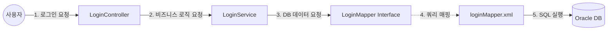

# Spring MyBatis 로그인 구조 검토 및 설명서

## 1. Spring + MyBatis 시스템 아키텍처

현재 프로젝트의 로그인 프로세스는 **Controller ↔ Service ↔ Mapper(Interface) ↔ Mapper(XML) ↔ DB**의 5단계 계층형 구조로 설계되어 있습니다.



---

## 2. 파일별 역할 및 상세 분석

### ① LoginController (컨트롤러)
- **파일**: `kr.co.sist.user.member.login.LoginController.java`
- **역할**: 사용자의 웹 요청 진입점
- **주요 기능**:
  - `loginFrm`: 로그인 화면으로 이동
  - `loginProcess`: 사용자가 입력한 아이디/비번을 받아 Service로 전달
  - **세션 처리**: 로그인 성공 시 `HttpSession`에 사용자 정보(`userId`, `userName`) 저장
- **구조적 특징**: `@Controller("userLoginController")`를 사용하여 빈(Bean) 이름 충돌을 방지한 설계가 적용됨.

### ② LoginService (서비스)
- **파일**: `kr.co.sist.user.member.login.LoginService.java`
- **역할**: 비즈니스 로직 수행 (비밀번호 검증)
- **주요 기능**:
  - Mapper를 호출하여 DB에서 암호화된 사용자 정보를 조회
  - **BCryptPasswordEncoder**: DB의 암호화된 비번과 입력받은 비번을 안전하게 비교
- **구조적 특징**: 데이터베이스 접근 로직과 비즈니스 로직이 분리되어 유지보수성이 높음.

### ③ LoginMapper (인터페이스)
- **파일**: `kr.co.sist.user.member.login.LoginMapper.java`
- **역할**: 자바 코드와 XML 쿼리를 연결하는 다리(Bridge)
- **주요 기능**: 메서드 명세(Signature)만 정의하면 MyBatis가 자동으로 구현체를 생성
- **중요 포인트**: 메서드 이름(`selectOneUserInfo`)이 XML의 `id` 속성값과 정확히 일치해야 함.

### ④ loginMapper.xml (XML 매퍼)
- **파일**: `src/main/resources/templates/user/mappers/loginMapper.xml`
- **역할**: 실행할 SQL 쿼리 정의
- **주요 기능**: 실제 DB에 전송될 `SELECT` 쿼리 보관
- **설정**: `resources` 폴더에 위치하여 자바 소스코드와 SQL을 물리적으로 완전히 분리함.

---

## 3. 검토 결과 및 핵심 개선 제안

### ✅ 잘된 점
1. **역할 분리**: MVC 패턴과 Layered Architecture에 따라 각 파일의 역할이 명확합니다.
2. **보안**: BCrypt 암호화를 사용하여 보안성이 확보되었습니다.
3. **위치 선정**: `mappers` xml 파일을 `resources` 경로로 분리하여 관리가 용이합니다.

### ⚠️ 개선이 필요한 부분 (Critical)
**문제점**: DB 컬럼명과 Java 객체 필드명의 불일치
- **DB 컬럼**: `USER_ID`
- **Java 필드**: `id` (`UserDomain` 클래스)

**현상**: MyBatis는 기본적으로 이름이 일치해야 데이터를 매핑합니다. 현재 상태에서는 쿼리 결과(`USER_ID`)를 자바 객체의 `id` 변수에 넣지 못해 데이터가 `null`이 될 위험이 있습니다.

**해결 방안**:
`loginMapper.xml`의 쿼리 부분을 수정하여 별칭(Alias)을 부여해야 합니다.

```xml
<!-- 변경 전 -->
select USER_ID, NAME, ...

<!-- 변경 후 (권장) -->
select USER_ID as id, NAME, ...
```

위의 별칭(`as id`) 작업만 완료되면, Spring MyBatis 구조상 완벽하게 동작하는 로그인 시스템이 됩니다.
